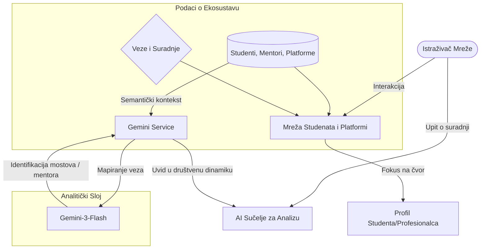
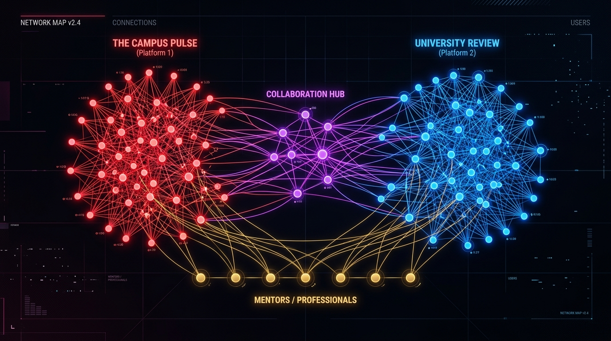

# Društvene mreže u studentskom novinarstvu te utjecaj na profesionalnu karijeru

**Autor:** Ema Cupać
**Datum:** 24. svibnja 2026.

## Sažetak
Ovaj seminar pruža sveobuhvatan teorijski i empirijski prikaz socijalne topologije studentskih medija te njihove uloge kao profesionalnog inkubatora. Prvi dio rada posvećen je aplikaciji "Media Network Explorer", interaktivnom alatu za vizualizaciju i analizu društvene mreže studentskih medija pomoću usmjerenih grafova (D3.js) i umjetne inteligencije (Google Gemini API). Drugi dio donosi detaljnu analizu dubinskih kvalitativnih intervjua bivših članova studentskog radija "Sova" i portala "Kišobran". Intervjui su zamišljeni kao polustruktuirani. Istraživanje se sadržavalo od 12 opširnih pitanja. Intervjui su strukturirani kroz šest ključnih, boldanih tematskih cjelina koje pokrivaju profesionalni zaokret i nesigurnost, institucionalni nedostatak prakse, razvoj praktičnih vještina, razvoj socijalnih kompetencija, socijalni kapital kroz umrežavanje, te izazove balansiranja akademskih obveza. Rezultati potvrđuju da neformalno umrežavanje i rano stjecanje praktičnog kapitala uvelike kompenziraju nedostatak formalnog kurikuluma. Također, s ovim istraživanjem dokazalo se koliko je studentska praksa bitna.

---

## Uvod
Pejzaž studentskih medija na sveučilištima u Republici Hrvatskoj, s posebnim naglaskom na Rijeku, povijesno je obilježen visokim stupnjem entuzijazma, ali i izraženom fragmentacijom. Studenti se često okupljaju oko pojedinačnih projekata, poput radija "Sova" ili portala "Kišobran", pri čemu su odnosi i tokovi informacija unutar tog ekosustava slabo vidljivi u formalnom smislu.

Problem koji se istražuje u sklopu ovog rada podijeljen je na dvije razine:
1. **Tehničko-strukturalna razina:** Kako mapirati i učiniti intuitivnim složeni graf suradnji i članstava gdje pojedinci djeluju kao premošćujući čvorovi (*bridging nodes*) između različitih platformi?
2. **Empirijsko-iskustvena razina:** Kako rad u tim medijima utječe na osobne i karijerne sudbine studenata s obzirom na niske razine formalne integracije u sveučilišne programe?

Cilj je ovog seminara premostiti jaz između kvantitativne topologije društvenih mreža (koju rješavamo i vizualiziramo pomoću "Media Network Explorer" alata) i življenog iskustva aktera kroz tematsku analizu njihovih iskaza.

---

## Tehnički i metodološki okvir: Media Network Explorer

### Tehnička arhitektura
Aplikacija "Media Network Explorer" funkcionira kao vizualni i analitički digitalni blizanac studentske medijske mreže:
1. **Frontend i vizualizacijski sloj:** Koristeći kombinaciju React-a i biblioteke D3.js (Data-Driven Documents), razvijena je dinamična simulacija sila (*force-directed graph*). Graf je strukturiran u krugovima (*radial layout*) gdje je koordinacija i udaljenost određena ulogama: od platformi u središtu, preko mentora u srednjem prstenu, do studenata u vanjskim prstenovima.
2. **Sloj inteligencije (AI):** Putem biblioteke `@google/genai` implementiran je sloj utemeljenog AI asistenta (informiran o točnoj topologiji mreže i njezinoj strukturi). Kada istraživač u sučelju postavi pitanje o povezivosti, sustav generira precizan semantički odgovor na temelju realnog stanja mreže.

### Tijek podataka (Data Flow)
Sljedeći dijagram prikazuje kako se podaci o ekosustavu procesiraju i pretvaraju u upotrebljive društvene informacije:

### Topologija mreže
Mreža se formalno modelira kao usmjereni graf $G = (V, E)$, gdje su ključni čvorovi definirani unutar tri kategorije (Studentske platforme, Studenti/Članovi i Profesionalci/Mentori). Topološka analiza pokazuje da su se osobe poput **X1** i **X2** pokazale kao kritični premošćujući čvorovi visoke centralnosti posredovanja (*betweenness centrality*) koji spajaju dvije odvojene ključne medijske domene.

*Slika 1. Integrirani i interaktivni graf društvene mreže studentskih medija u "Media Network Explorer" sučelju, koji zorno prikazuje red/blue klastere platformi s premošćujućim crveno-plavim (ljubičastim) čvorovima u samoj sredini te mentorske rute u dnu.*

---

## Analiza kvalitativnih intervjua: Iskustva studenata u medijskom ekosustavu

Za potrebe produbljivanja razumijevanja podataka vizualiziranih u grafu, provedeni su polustrukturirani intervjui s bivšim i sadašnjim studentima koji su radili na studentskom radiju "Sova" (povezan s Radio Rijekom) i portalu "Kišobran". Transkripti njihovih svjedočanstava analizirani su i klasificirani u **šest ključnih tematskih cjelina**:

### 1. **Nesigurnost u budućnost i radikalan preokret u životnom planu**
Mnogi studenti ulaze u svijet studentskih medija bez ikakve dugoročne namjere o izgradnji novinarske karijere. Iskustvo rada na platformi često se manifestira kao neočekivani katalizator promjene smjera:
- **Neočekivani obrat:** Jedna sugovornica navodi: *"Nisam imala nikakve ideje da bi ja možda završila na radiju. Ta Sova me onako okrenula u nekom drugom smjeru... uopće mi to nije bila ideja s 18 godina."*
- **Slučajnost i privlačnost medija:** Sugovornici ističu da su se u novinarstvu našli *"totalno slučajno"*, ali da ih je praksa snažno *"zakačila"* tako da se više nisu mogli zamisliti u drugim strukama. To je vidljivo iz impresivnih profesionalnih putanja – od potpunog ignoriranja novinarstva do rada u prestižnim redakcijama (poput *24sata*), bavljenja PR-om te, u konačnici, rada u **Europskom parlamentu u Briselu**.
- **Geografska ograničenja:** Lokalpatriotizam se javlja kao prepreka za formalno studiranje (primjerice, odluka o ostanku u Rijeci unatoč nepostojećem studiju novinarstva), pri čemu studentske platforme služe kao jedini supstitut za stručno usavršavanje u regiji.

### 2. **Sustavan nedostatak studentske prakse i formalnog priznanja**
Drugi dominantan motiv koji proizlazi iz iskaza je potpuni raskorak između sveučilišne nastave i stvarne potrebe za profesionalnim iskustvom:
- **Institucionalna neusklađenost:** U vrijeme začetka projekata, na matičnim fakultetima nije postojalo apsolutno ništa što je nudilo formalnu poveznicu s medijima. Dobivanje ECTS bodova za rad bilo je nemoguće: *"Nije se moglo ništa priznavati, ni kao ECTS-i nije bilo u sklopu ničeg. To je bila naša dobra volja..."*
- **Nedostatak teorijskog kadra:** Studenti su istaknuli dramatičan nedostatak teorijskog vodstva u sklopu studiranja: *"Mi nismo imali profesora novinarstva nijednog, mi smo imali novinare u praksi... koji nam nisu mogli nekakvu teoriju prenijeti."*
- **Zahtjev za 'crno na bijelom' priznanjem:** Postoji izražena žalost što praksa nije bila formalno priznata (npr. kao izborni kolegij) što bi studentima uvelike olakšalo dokazivanje kompetencija na tržištu rada, bez potrebe da prilažu sat sate snimljenog materijala budućim poslodavcima.

### 3. **Praktičan rad i stjecanje zanatskih kompetencija ('Learning by doing')**
Unatoč nedostatku formalne podrške, studentske su platforme služile kao iznimno učinkovite platforme za stjecanje onoga što sugovornici nazivaju *"zanatskim dijelom posla"*:
- **Fokusirano mentorstvo u praksi:** Dok je u početku vladalo načelo snalaženja i učenja na vlastitim pogreškama, ključan korak bio je angažman iskusnih profesionalaca s Radio Rijeke (npr. mentori **X3**, **X4**, **X5**). Feedback je bio izravan, temeljit i na dnevnoj bazi: *"preslušavali su svaku minutu našeg programa. Dobivali smo detaljne feedbackove na voditeljski dio, na glazbu, na džinglove, na previše smijanja u eteru... doslovno na sve."*
- **Pristup profesionalnoj opremi:** Iskustvo rada s miješalima, mikrofonima i softverom za montažu predstavlja ključnu prednost: *"Naučio sam raditi s opremom to mi je jako bitno jer nema svatko priliku... imati pristupu ovakvoj dobroj opremi."*
- **Profesionalna pravila i etika:** Studenti su usvojili fundamentalna novinarska pravila, poput pravila "7 provjera": *"da 7 puta provjeriš informaciju, da nazoveš 7 različitih izvora... da uvijek moraš imat više strana priče"*, te pisanje vijesti po principu 5 zlatnih pitanja (Tko? Što? Kada? Gdje? Zašto?).

### 4. **Izgradnja samopouzdanja i razvoj socijalnih vještina**
Rad u medijima transformirao je sugovornike iz akademski pasivnih jedinki u aktivne, asertivne profesionalce:
- **Prevladavanje introvertiranosti:** Javni nastup pred mikrofonom ima snažan psihološki utjecaj: *"Mogu reći da jesam malo introvert, ali ovo mi je dosta dalo da postanem više ekstrovert... jer se moraš staviti u stresne situacije."*
- **Socio-komunikacijska oštrina:** Svakodnevna komunikacija s različitim profilima sugovornika putem telefona, e-pošte ili uživo izoštrava socijalne vještine do razine profesionalne spremnosti.
- **Građenje osobnog identiteta:** Moto *"jednom sova, uvijek sova"* svjedoči o tome kako rad u ovim medijima trajno obilježava i uobličuje identitet i osobnost sudionika.

### 5. **Socijalni kapital i dugoročne mreže (Networking)**
Ova tema izravno korespondira s našom mrežnom vizualizacijom i dokazuje da su studentski mediji epicentar stvaranja nemjerljivog socijalnog kapitala:
- **Dostupnost autoriteta:** Kroz studentske intervjue stvoreni su kontakti koji traju desetljećima. Jedna od sugovornica opisuje odnos s bivšom rektoricom **X6** i bivšim rektorom **X7**: *"ta žena bi se meni uvijek odazvala samo zato što smo izgradile odnos još kad sam ja bila klinka... znala me kao studenticu"*. Ta mreža kasnije eliminira potrebu za *"vlačenjem za rukav"* u profesionalnoj karijeri.
- **Doživotna prijateljstva unutar struke:** Generirani čvorovi u grafu nisu samo profesionalni odnosi već i duboka prijateljstva. Mnogi akteri (poput kolegice **X8**, mentora **X5** i kolegice **X9**) nastavili su raditi u istoj industriji, surađujući i razmjenjujući resurse kroz razne agencije, medije i regionalne institucije.

### 6. **Usklađivanje obveza i izazovi akademskog preopterećenja**
Empirijski podaci otkrivaju i zahtjevnu stranu visokog studentskog angažmana – ekstremne napore koji su potrebni za balansiranje zahtjevnih studija i rada do kasno u noć:
- **Učenje u studiju i noćne šihte:** Rad na radiju "Sova" često podrazumijeva noćne šihte: *"dežurstvo od ponoći do tri ujutro, a u devet ujutro predavanje iz epistemologije... to je bilo najteže, ustati ujutro i biti donekle suvisao."*
- **Raskorak između društveno-humanističkog i prirodoslovnog svijeta:** Studenti s teškim, eksperimentalnim studijima (poput biotehnologije, organske kemije ili fizikalne kemije) doživljavali su ozbiljan kognitivni nesklad – dok su jedan dio tjedna pisali medijske projekte i vodili intervjue, drugi dio tjedna morali su iznimno pažljivo raditi zahtjevne laboratorijske vježbe.
- **Tenzije oko financiranja:** Godinama prisutan problem bio je odnos sa Studentskim zborom oko proračuna. Konstantno rezanje sredstava (poput satnica od 8 do 10 kuna), potreba za kompliciranim pisanjem izvješća te u konačnici ukidanje financiranja nakon loše komunikacije između uredništva i vodstva zbora pridonijeli su tranziciji prema isključivom volontiranju.

---

## Zaključak i preporuke
Vizualizirani mrežni model i kvalitativna analiza pokazuju da studentski mediji funkcioniraju kao vitalna, ali nedovoljno zaštićena infrastruktura. Mentori (poput Profesionalca 1 i Profesionalke 2) te iskusni studenti s hibridnim ulogama (poput kolegice **X10** odnosno Profesionalke 3) predstavljaju srž ovog sustava koji stvara gotove stručnjake za tržište.

Kako bi se poboljšao ovaj sustav, preporučuje se:
1. **Kurikularna integracija:** Implementacija studentske prakse u obliku izbornih kolegija s dodijeljenim ECTS bodovima.
2. **Financijska stabilnost:** Osiguravanje transparentnog, izravnog i stabilnog modela financiranja od strane Sveučilišta, izbjegavajući birokratske sukobe sa Studentskim zborom.
3. **Formalna mentorska struktura:** Zapošljavanje vanjskih novinarskih mentora koji će kontinuirano držati radionice i olakšati sustavno prenošenje praktične teorije.

## Reference
1. Google. (2024). *Gemini API Documentation*. Preuzeto s https://ai.google.dev
2. Bostock, M. (2025). *D3.js: Data-Driven Documents*. https://d3js.org
3. Dokumentacija za NotebookLM. (2025). *Knowledge Grounding Strategies*. https://notebooklm.google.com/
4. Scott, J. (2017). *Social Network Analysis*. SAGE Publications.
5. Transkripti polustrukturiranih intervjua bivših članova radija "Sova" i portala "Kišobran" (2026). Interni arhiv istraživanja.
